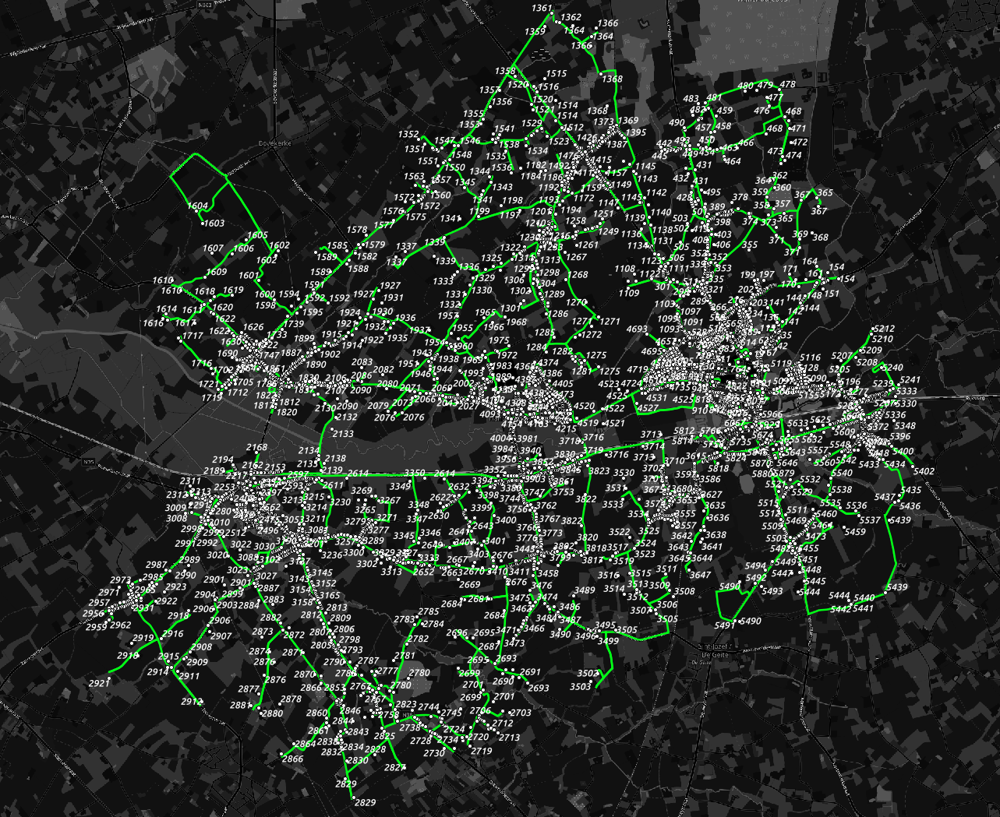

# streetscan-planner

[/statusIcon)](https://build.anyways.eu/viewType.html?buildTypeId=Itinero_Projects_StreetscanPlanner)  

This is a small application to optimize routes to drive along all locations in an area. 

Documentation is available [here](docs/).

## Overview

This tool:

- Loads a routing network from OSM **for Belgium** (extensions for other countries are possible later)
- Loads a set of locations from a CSV file.
- Calculates the best path along the locations:
  - Start location is the first location in the CSV.
  - End location can be anywhere.
  - Tries to avoid u-turns where possible.

The result is something like this:

